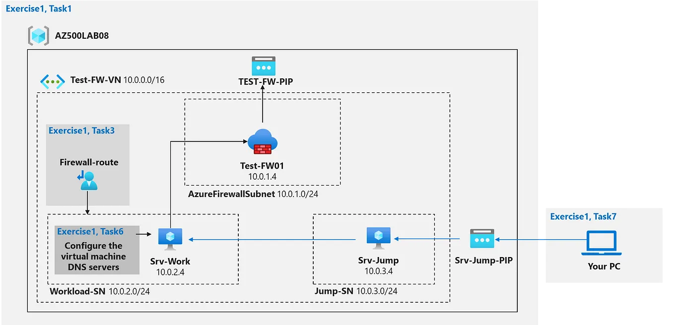

# Plan and implement security for public access to Azure resources

This repo contains a demo for Azure Firewall. It includes a virtual network with a workload subnet and a jump host subnet, a virtual machine is each subnet, a custom route that ensures all outbound workload traffic from the workload subnet must use the firewall, Firewall Application rules that only allow outbound traffic to www.bing.com. and Firewall Network rules that allow external DNS server lookups.

You will get prompted during the AZD deployment step for the region to deploy this scenario.

This scenario can be deployed to Azure using the [Azure Developer CLI - AZD](https://learn.microsoft.com/en-us/azure/developer/azure-developer-cli/overview?WT.mc_id=AZ-MVP-5000671). 

💪 This template scenario is part of the larger **[Microsoft Trainer Demo Deploy Catalog](https://aka.ms/trainer-demo-deploy/?WT.mc_id=AZ-MVP-5000671)**.

## ⬇️ Installation
- [Azure Developer CLI - AZD](https://learn.microsoft.com/en-us/azure/developer/azure-developer-cli/install-azd?WT.mc_id=AZ-MVP-5000671)
    - When installing AZD, the above the following tools will be installed on your machine as well, if not already installed:
        - [GitHub CLI](https://cli.github.com?WT.mc_id=AZ-MVP-5000671)
        - [Bicep CLI](https://learn.microsoft.com/en-us/azure/azure-resource-manager/bicep/install?WT.mc_id=AZ-MVP-5000671)
    - You need Owner or Contributor access permissions to an Azure Subscription to  deploy the scenario.

## 🚀 Deploying the scenario in 3 easy steps:

1. From within a new folder on your machine, run `azd init` to initialize the deployment.
```
azd init -t petender/azd-addsvm
```
2. Next, run `azd up` to trigger an actual deployment.
```
azd up
```
3. If you want to delete the scenario from your Azure subscription, use `azd down`
```
azd down --purge --force
```

⏩ Note: running `azd down` deletes the RG and Resources, but will keep the artifacts on your local machine.

## What is the demo scenario about?

### Plan and implement security for public access to Azure resources

👉 https://blog.azinsider.net/56a7b72025ce?source=friends_link&sk=cf85213a66dae0e202491717f51a9c6f

### Use case

You have been asked to install Azure Firewall. This will help your organization control inbound and outbound network access which is an important part of an overall network security plan. Specifically, you would like to create and test the following infrastructure components:

A virtual network with a workload subnet and a jump host subnet.
A virtual machine is each subnet.
A custom route that ensures all outbound workload traffic from the workload subnet must use the firewall.
Firewall Application rules that only allow outbound traffic to www.bing.com.
Firewall Network rules that allow external DNS server lookups.

## Solution Overview 

This scenario is based on and aligned with the Microsoft Certification: AZ-500: Microsoft Azure Security Technologies.

This scenario creates the following infrastructure components:

 - A virtual network with a workload subnet and a jump host subnet.
 - A virtual machine is each subnet.
 - A custom route that ensures all outbound workload traffic from the workload subnet must use the firewall.
 - Firewall Application rules that only allow outbound traffic to www.bing.com.
 - Firewall Network rules that allow external DNS server lookups.


